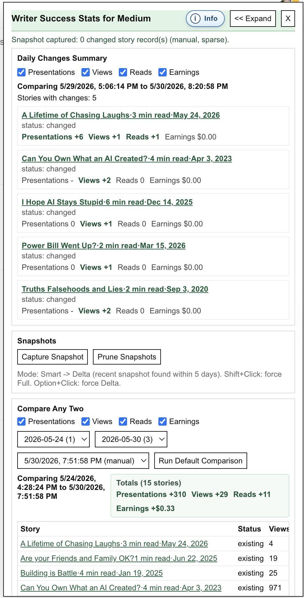
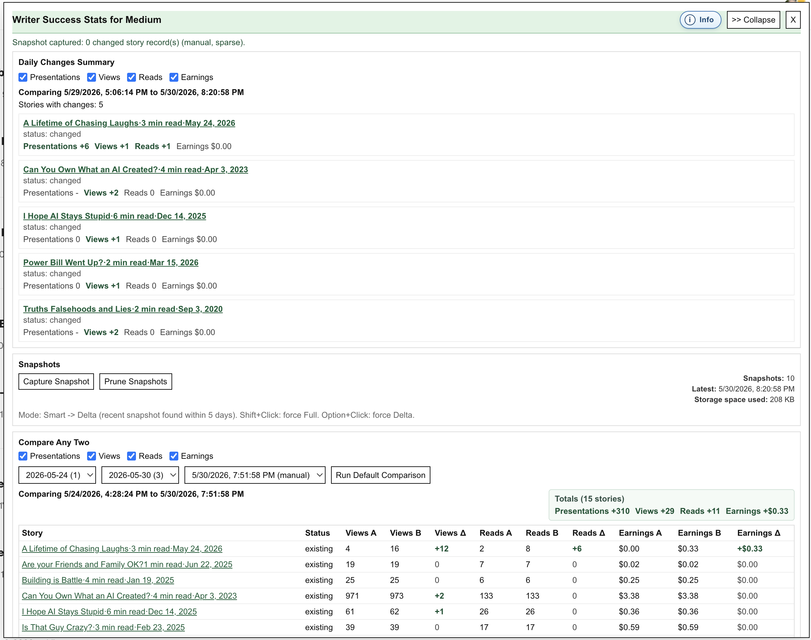

# Writer Success Stats for Medium

A Chrome extension for Medium authors that captures and compares story performance snapshots from the Medium stats page.

Target page: https://medium.com/me/stats

Created by  Frank Font 2026

## What It Tracks

For each story snapshot:

- Story Name
- Presentations Count
- Views Count
- Reads Count
- Earnings Amount
- Snapshot Timestamp
- Medium URL
- Story ID

This extension stores values as text and numbers. It does not take screenshots.

## Snapshot Behavior

- Automatic snapshot: once per day on the first visit to `https://medium.com/me/stats`.
	- If at least one snapshot exists within the last 5 days, auto capture prefers a delta snapshot.
	- Otherwise, auto capture creates a full snapshot.
- Manual snapshot: user triggers one `Capture Snapshot` button.
	- Smart mode chooses delta when a recent snapshot exists (within 5 days).
	- Smart mode chooses full when no prior snapshot exists or no recent snapshot exists.
	- `Shift+Click` on `Capture Snapshot` forces a full snapshot.
	- `Option+Click` on `Capture Snapshot` forces a delta snapshot.
- Multiple manual snapshots per day are allowed.
- During capture, the status area shows live progress messages while row loading/scrolling is in progress.
- Hybrid storage model:
	- First snapshot of each day is stored as a full snapshot.
	- Later snapshots on the same day are stored sparsely (only changed story records).
	- Compare, daily summary, and trend views materialize sparse snapshots back into full point-in-time states before computing diffs.
- Snapshot key: `Story Name + timestamp`.

## Panel Access

The extension panel is available from the Chrome toolbar and from keyboard shortcuts.

Open methods:

- Click the extension icon in the Chrome toolbar to open the panel.
- Use a keyboard shortcut to open the panel when viewing `https://medium.com/me/stats`.

## Daily Changes Summary

The panel includes an easy-access **Daily Changes Summary** near the top.

- It automatically compares the latest snapshot against a daily baseline.
- If exactly one snapshot exists, a prominent note explains that daily stats will be available the next day you open the panel.
- Daily baseline rule:
	- Use the **earliest snapshot** from the **most recent prior day**.
	- If no prior day exists, use the **first snapshot from the current day**.
- Metric filter checkboxes are available for: Presentations, Views, Reads, Earnings.
- All metric filters are enabled by default.
- If a metric checkbox is unchecked, that metric no longer qualifies a story for inclusion in the summary.
- It shows only stories with actual numeric tracked changes.
- It highlights Presentations, Views, Reads, and Earnings deltas for quick scanning.
- Positive deltas are always prefixed with `+`.

## Compare Quick Buttons

The **Compare Any Two** area supports manual picker-based comparisons and quick compare buttons.

- Compare results auto-refresh when Base/Target day or snapshot selections change.

- Metric filter checkboxes are available for: Presentations, Views, Reads, Earnings.
- All compare metric filters are enabled by default.
- If a metric checkbox is unchecked, that metric no longer qualifies a story for inclusion in compare results.

- Quick compare logic:
	- `Compare Oldest to Newest`:
		- Base snapshot (A): **earliest available snapshot from the earliest date**.
		- Target snapshot (B): **latest available snapshot from the latest date**.
	- `Compare 7 Days Ago to Newest`:
		- Base snapshot (A): snapshot nearest to **7 days before** the latest snapshot timestamp.
		- Target snapshot (B): **latest available snapshot**.
		- Button is shown only when a snapshot exists within **+/-2 days** of the 7-day target.
		- Button label reflects the actual selected offset (example: `Compare 6 Days Ago to Newest`).
	- `Compare 30 Days Ago to Newest`:
		- Base snapshot (A): snapshot nearest to **30 days before** the latest snapshot timestamp.
		- Target snapshot (B): **latest available snapshot**.
		- Button is shown only when a snapshot exists within **+/-2 days** of the 30-day target.
		- Button label reflects the actual selected offset (example: `Compare 29 Days Ago to Newest`).

- Advanced Features controls:
	- Hold `Shift` while clicking `Compare Oldest to Newest` to reveal `Audit Snapshot Pair`, `Export Audit JSON`, `Export A/B JSON`, the `Advanced Features: Transfer Data` section, and the `Advanced Features: Delete Data` section.
	- Click `Hide Advanced Features` to collapse all revealed Advanced Features controls and sections.
	- Click `Compare Oldest to Newest` without `Shift` also hides those Advanced Features controls again.

These quick buttons provide full-range and time-window comparisons across available saved history.

## Keyboard Shortcuts

Default shortcuts (Mac):

- `Option+Shift+S`: Open the extension panel and run a manual snapshot.
- `Option+Shift+0`: Open the extension panel and focus comparison controls.
- `Option+Shift+D`: Open the extension panel and jump to Daily Changes Summary.

Shortcut setup:

- Open `chrome://extensions/shortcuts` to view or customize shortcuts.
- If a shortcut conflicts with another extension, reassign it in Chrome shortcuts settings.

## Parsing Behavior

- Data source is the Medium stats page DOM.
- The extension resets scroll position to the top, then auto-scrolls downward to load more rows.
- Capture status displays live pass/row-count progress during auto-scroll so long operations are visible.
- Scroll stop rule: stop when no new rows appear after `N` scrolls, where `N = 3`.
- Number/currency format assumption: American English only.

## Comparisons and Diff Rules

The UI supports:

- Daily baseline comparison
- Any two snapshots selected by user
- Trend over time

Comparison outputs include:

- Baseline and target values (`A` and `B`) for Views, Reads, Earnings
- Delta columns with signed values (`+` for positive)
- Percent delta columns with signed values
- Color coding for positive/negative changes

Story presence rules:

- Present in target only: `new`
- Present in base only: `removed`
- Present in both: `existing`

## Trend Over Time Logic

- Rows are sorted most recent first.
- For **today**, multiple snapshots may appear.
- For any **earlier day**, only that day's most recent snapshot is shown.
- Trend table output is capped to 10 displayed rows when more are available:
	- oldest 5 rows,
	- then `...`,
	- then newest 5 rows.
- `Show Trend` also opens an SVG line chart overlay for the selected story:
	- Views line: orange
	- Reads line: blue
	- Earnings line: green
	- X-axis is days and lines connect point-to-point directly (snapshot gaps are not expanded with empty points).
	- If there are more than 1000 trend points, chart plotting is downsampled to every 10th point, including oldest and newest.
- The chart overlay spans the panel area between the panel header and the Trend section.
- Close behavior:
	- Click the chart `Close` button, or
	- Click anywhere outside the chart overlay.
- If total stories exceed the trend picker max group size (default `50`), story selection is split into A-Z filter groups.
	- Each letter is shown.
	- Empty letters are disabled.
	- If a letter exceeds the max size, that letter is split into numbered groups (example: `D1`, `D2`, `D3`).
- Hidden advanced setting:
	- Hold `Shift` while clicking `Show Trend` to reveal a normally hidden max-group-size input.
	- Set a new max and click `Set Max` to rebuild trend filter groups with that size.
	- Allowed range is `2` to `1000` stories per group.
	- The chosen max value is saved in extension local storage and persists across browser restarts.

## Panel Usability

- The panel has an `Expand`/`Collapse` button to widen the layout for large comparison tables.
- The floating `WSM` launcher turns green when Reads or Earnings increased in the default daily comparison.
- Snapshot summary now shows:
	- `Storage space used (on disk)` from `chrome.storage.local` bytes-in-use.
	- `Stored snapshots JSON` byte estimate (shown when it meaningfully differs from on-disk usage).
	- `Estimated full (uncompressed) footprint` byte estimate.
	- `Storage reduction` percent versus estimated full footprint.

## Data Management

- Storage uses `chrome.storage.local` and persists across browser sessions.
- New snapshots store stable `storyRef` identities (from the master map) with only required metric fields; display and compare views materialize full story details by resolving refs through the master map.
- `Prune Snapshots` coalesces each day into one merged full snapshot (max coverage union across that day) and removes same-day duplicates.
- `Transfer Data` section supports full export/import:
	- `Export All` writes all snapshots to a versioned transfer JSON envelope and copies to clipboard when available.
	- `Export All` is intentionally transfer-encoded when compression helps: the output may contain an `encoding` field such as `lz-utf16` plus an `encodedPayload` string instead of plain readable snapshot JSON.
	- `Export Latest Snapshot` writes the latest raw stored snapshot JSON (internal storage shape) to the Transfer Data text box and copies it to clipboard when available.
	- `Export Latest Snapshot` shows the actual internal snapshot shape, so sparse snapshots may contain only changed rows and can legitimately export `stories: []` when no changes were detected versus the baseline snapshot.
	- Transfer export remains in traditional full story-row format (`storyName`, `storyId`, `mediumUrl`, metrics) for compatibility, even though internal snapshot storage is `storyRef`-based.
	- Export uses `lz-utf16` (pure JavaScript string compression), with plain JSON fallback if compression fails.
	- Export automatically skips compression when compressed output is larger than original JSON.
	- `Import All` restores traditional full-field snapshot exports and converts them into internal `storyRef`-based storage.
	- `Compression Test` runs a small round-trip compress/decompress test and writes a PASS/FAIL diagnostic report into the Transfer Data text box.
	- `Create Master Map` creates/updates a persistent master story map in local storage by scanning all existing snapshots; it does not rewrite or transform snapshot rows.
	- Master map now stores story presentation metadata from the stats page (`min read` and published date) and tracks changes over time in `presentationMetadataHistory` per story.
	- Each story also keeps `latestReadTimeText` and `latestPublishedDateText` for quick access to the most recently seen values.
	- `presentationMetadataHistory` entries maintain `firstSeenAt`, `lastSeenAt`, and `seenCount` using unique snapshot timestamps, so rerunning `Create/Update Master Map` on unchanged data does not inflate counts.
	- `Replace Master Map` shows a confirmation warning and rebuilds the existing master map from all snapshots, preserving existing `s#` refs where possible and merging duplicates when identities resolve to the same story.
	- Master map name-based matching uses a canonical title form (removes volatile `min read`/date/`View story` suffix text) to avoid duplicate mappings for the same story.
	- `Export Master Map` exports raw master map JSON content to the Transfer Data text box (and clipboard when available).
	- Import compatibility includes: `lz-utf16`, prior `deflate-raw-base64`, and legacy plain JSON exports.
- Advanced comparison export:
	- `Export A/B JSON` is available via Advanced Features controls (Shift + `Compare Oldest to Newest`).
- `Advanced Features: Delete Data` is hidden by default and is revealed from Advanced Features controls.
- `Delete Data` currently supports deleting by specific timestamp in the visible UI.

## Scope and Constraints

- Chrome Extension `manifest_version: 3`
- Single Medium account/profile per browser context
- No multi-account partitioning

## Error Handling

The extension should show clear user-facing errors for cases such as:

- Not logged into Medium
- Empty or unavailable stats page
- Parsing/selectors failure
- Incomplete row loading

## Privacy

- This extension is not designed to share any author information with any websites.
- Snapshot data remains local in browser extension storage.
- The extension does not transmit snapshot data to external services.

## Quick Start (Unpacked Extension)

1. Open Chrome and go to `chrome://extensions`.
2. Enable Developer mode.
3. Click Load unpacked.
4. Select the `writer-success-stats-for-medium` folder.
5. Visit `https://medium.com/me/stats` while logged into Medium.
6. Open the extension panel from the toolbar icon or keyboard shortcut to create manual snapshots and run comparisons.
7. Use `Compare Oldest to Newest` for full-range compare or Daily Changes Summary for day-level change detection.

## Example Panel

